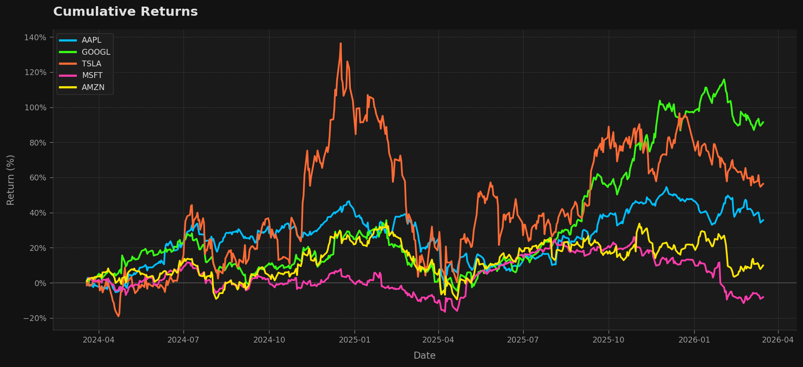
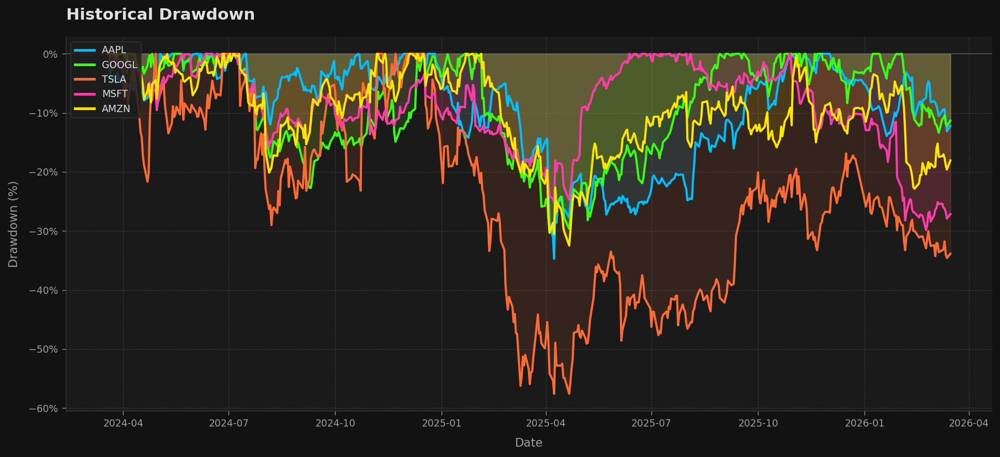

<p align="center">
  
  
  
  
  
</p>

<h1 align="center">Portfolio Analyst</h1>
<p align="center">Quantitative risk/return analysis for international equity portfolios · Dark terminal aesthetic</p>

---

## 🇺🇸 English

### Overview

**Portfolio Analyst** is a single-class Python tool that downloads two years of historical equity data, computes institutional-grade risk metrics, suggests minimum-variance portfolio weights, and renders Bloomberg Terminal–style charts.

Assets covered: `AAPL` · `GOOGL` · `TSLA` · `MSFT` · `AMZN` · benchmark `SPY`

### Metrics

| Metric | Formula | Interpretation |
|---|---|---|
| **Sharpe Ratio** | `(Rp − Rf) / σp` | Risk-adjusted return per unit of total volatility |
| **Sortino Ratio** | `(Rp − Rf) / σd` | Same, but penalises only downside deviation |
| **Beta (CAPM)** | `Cov(Rp, Rm) / Var(Rm)` | Systematic market sensitivity vs. SPY |
| **Max Drawdown** | `(Trough − Peak) / Peak` | Worst peak-to-trough decline in the period |
| **Inv-Var Weights** | `(1/σ²) / Σ(1/σ²)` | Minimum-variance allocation heuristic |

### Charts





### Quick Start

```bash
# 1 · Clone
git clone https://github.com/Jhosep20-code/portfolio-analyst.git
cd portfolio-analyst

# 2 · Install dependencies
pip install -r requirements.txt

# 3 · Run
python portfolio_analyst.py
```

Two PNG charts are saved to the project directory automatically.

---

## 🇪🇸 Español

### Resumen

**Portfolio Analyst** es una herramienta Python de clase única que descarga dos años de datos históricos de acciones, calcula métricas de riesgo de nivel institucional, sugiere pesos de mínima varianza y genera gráficos con estética Bloomberg Terminal.

Activos analizados: `AAPL` · `GOOGL` · `TSLA` · `MSFT` · `AMZN` · benchmark `SPY`

### Métricas

| Métrica | Fórmula | Interpretación |
|---|---|---|
| **Sharpe Ratio** | `(Rp − Rf) / σp` | Retorno ajustado por riesgo sobre volatilidad total |
| **Sortino Ratio** | `(Rp − Rf) / σd` | Igual, pero penaliza solo la desviación a la baja |
| **Beta (CAPM)** | `Cov(Rp, Rm) / Var(Rm)` | Sensibilidad al mercado respecto al SPY |
| **Max Drawdown** | `(Valle − Pico) / Pico` | Peor caída desde máximos en el período |
| **Pesos Inv-Var** | `(1/σ²) / Σ(1/σ²)` | Heurística de asignación de mínima varianza |

### Gráficos


### Cómo ejecutarlo

```bash
# 1 · Clonar
git clone https://github.com/Jhosep20-code/portfolio-analyst.git
cd portfolio-analyst

# 2 · Instalar dependencias
pip install -r requirements.txt

# 3 · Ejecutar
python portfolio_analyst.py
```

Los dos gráficos PNG se guardan automáticamente en el directorio del proyecto.

---

## Author / Autor

**Jhosep Michael Yachi Garcia** *(Jhosep)*  
Estudiante de 9no ciclo de Ingeniería de Sistemas e Informática — UTP

[](https://github.com/Jhosep20-code)
